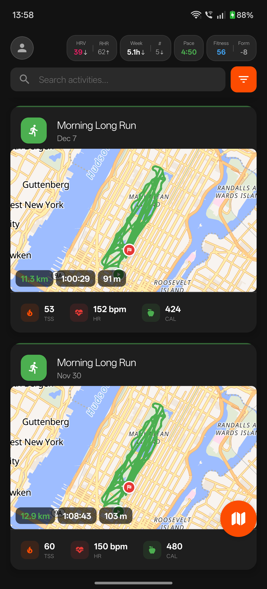
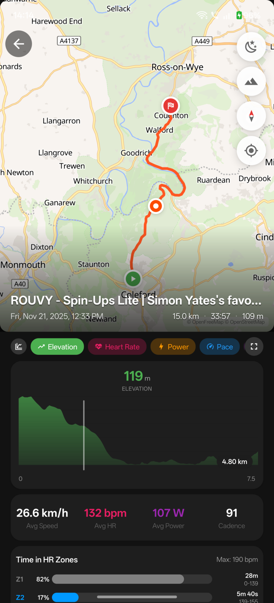
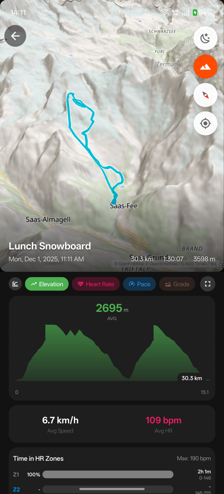
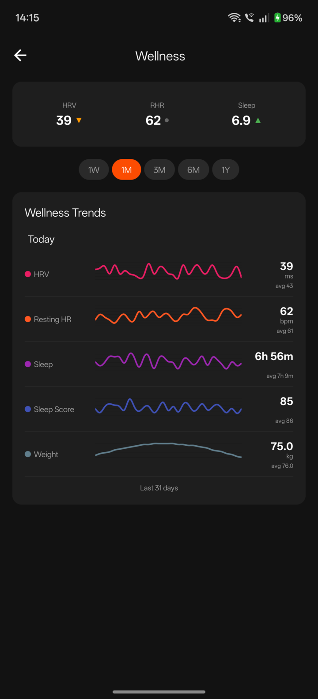
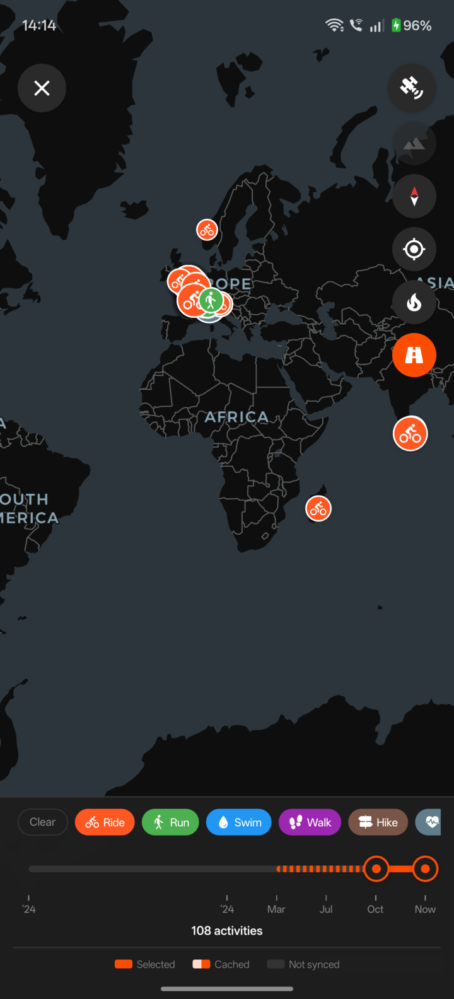
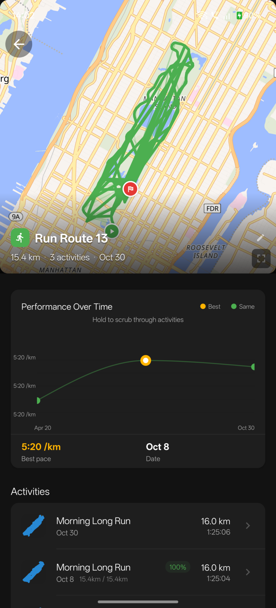
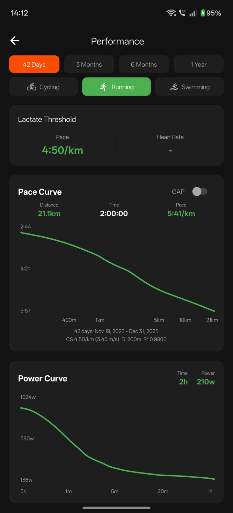

# Veloq

Open-source mobile client for viewing your Intervals.icu data.

Not affiliated with Intervals.icu.

## Screenshots

| Feed                             | Activity Map                                     | 3D View                                    | Charts                               |
| -------------------------------- | ------------------------------------------------ | ------------------------------------------ | ------------------------------------ |
|  |  |  |  |

| Fitness                                | Regional Map                                     | Routes                               | Performance                                    |
| -------------------------------------- | ------------------------------------------------ | ------------------------------------ | ---------------------------------------------- |
|  |  |  |  |

## Links

- Website: [veloq.fit](https://veloq.fit)
- App Store: [Download on the App Store](https://apps.apple.com/us/app/veloq/id6757836732)
- Google Play: [Get it on Google Play](https://play.google.com/store/apps/details?id=com.veloq.app)
- Privacy: [veloq.fit/privacy](https://veloq.fit/privacy)
- Releases: [github.com/evanjt/veloq/releases](https://github.com/evanjt/veloq/releases)

## License

Apache 2.0
